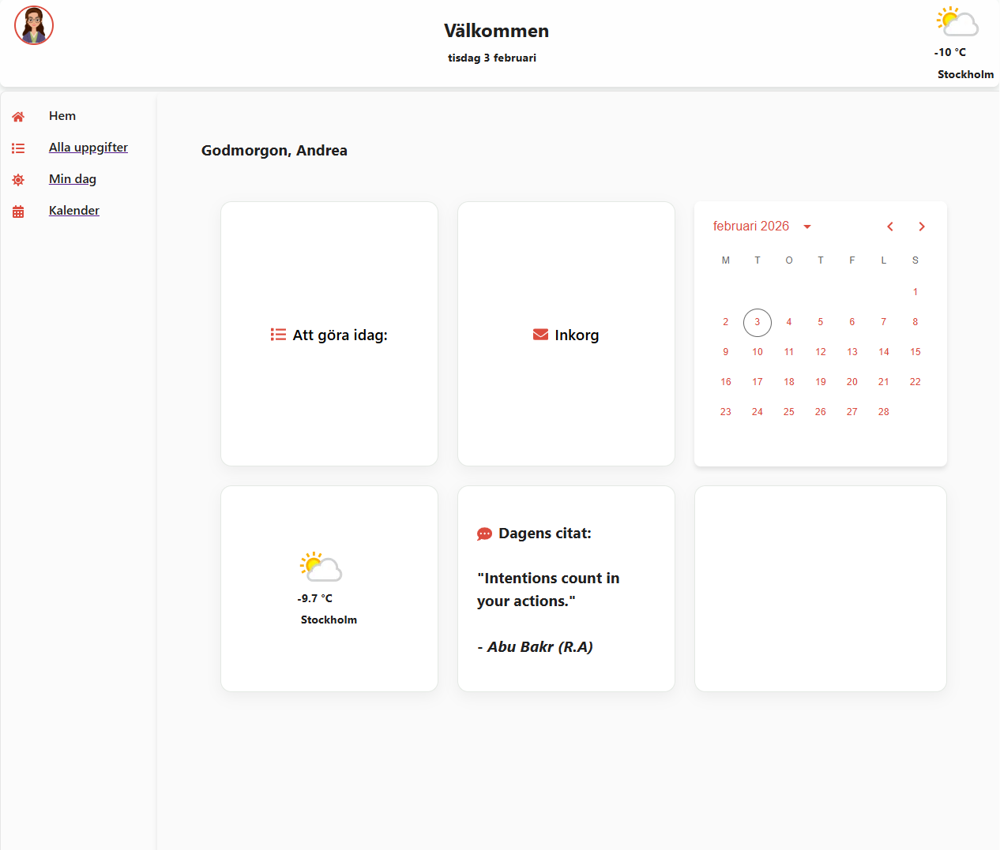

# 📅 Todo App
En simpel Todo App där du kan lägga till dina uppgifter men även kunna se kalender, strukturera upp hur din dag ska se ut, se vädret och få se dagens citat.  

## 🌟 Uppfyllda krav
- **SPA + Routing (React Router)**
    - 8 routes/views
    - Använt NavLink som navigering
- **Komponentstruktur + Props**
    - Appen består av flera återanvändbara komponenter.
    - Minst en komponent ska ta emot data via props och visa upp datan.
- **State + Interaktivitet (useState)**
    - formulär (kontrollerade inputs)
- **Data + API (useEffect + ex: fetch)**
    - Appen ska hämta data från ett API med (exempel) fetch i useEffect.
    - Visa minst: loading state och enkel felhantering (t.ex. “Kunde inte hämta data”).
    - Hämtad data ska användas och visas i användargränssnittet.


 ## 📦 Installation

1. Clone the repository:

```
git clone https://github.com/AVega89-0407/TodoApp.git
```

2. Install dependencies:
```
npm install
```

3. Start development server:
```
npm run dev
```

4. Open in browser:
```
http://localhost:5173
```

## 🗂️ Project Structure
```
src/
├── assets/
│   └── 1c369b9f-5b2f-41c8-94e0-ed96a1e13bb9.jpg
├── components/
│   ├── Calender.jsx
│   ├── CustomizedTimeline.jsx
│   ├── Greeting.jsx
│   ├── Navbar.jsx
│   ├── Navigation.jsx
│   ├── TodoForm.jsx
│   ├── TodoHeader.jsx
│   ├── TodoItem.jsx
│   └── TodoList.jsx
├── Layout/
│   ├── MainLayout.css
│   └── MainLayout.jsx
├── pages/
│   ├── ActiveTodos.jsx
│   ├── AllTodos.jsx
│   ├── CalenderPage.jsx
│   ├── CompletedTodos.jsx
│   ├── Home.jsx
│   ├── MyDay.jsx
│   ├── NotFound.jsx
│   └── SideBar.jsx
├── services/
│   ├── QuoteApi.jsx
│   └── WeatherApi.jsx
├── App.jsx
├── main.jsx
```
## 📸 Screenshots

**Home.jsx**



## 👤 Author

🌸 **Andrea Vega Piñones**

📍 React project for learning and practical use
